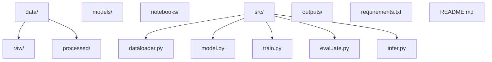
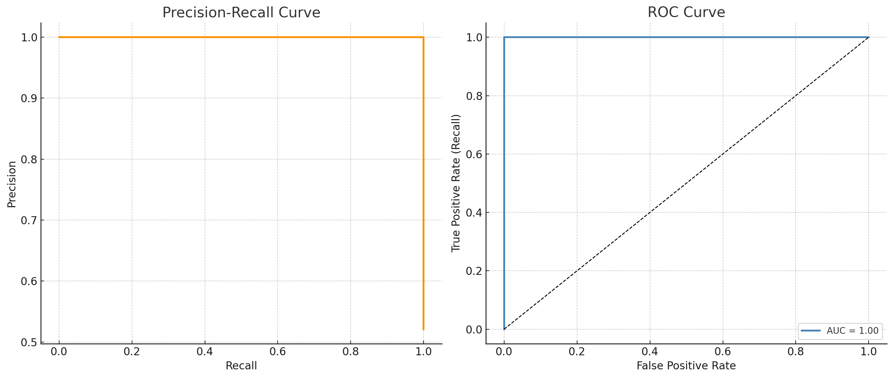

# 🧠 Brain Tumor Image Segmentation Using Deep Neural Networks

This project utilizes deep learning techniques to automate **semantic segmentation** of brain tumors in **MRI scans**. By leveraging the **U-Net** architecture with encoder-decoder layers and skip connections, this system automatically detects and segments tumor regions, aiding in **neuro-oncology** diagnostics.

---

## 📌 Key Highlights

- **Model Architecture**: U-Net with encoder-decoder and skip connections
- **Dataset**: BRATS 2020 (Multimodal MRI scans for brain tumor segmentation)
- **Evaluation Metrics**: 
  - Dice Coefficient
  - Intersection over Union (IoU)
  - Precision
  - Recall
- **Framework**: TensorFlow 2.x / PyTorch
- **Output**: Binary segmentation masks highlighting tumor regions

---

## 🧠 Background

Brain tumor segmentation plays a critical role in the diagnosis and treatment of brain tumors. Traditional manual segmentation is labor-intensive and prone to inaccuracies. This project automates the process using deep learning models to improve both **accuracy** and **efficiency**, providing a scalable solution for medical professionals.

---

## 🗂️ Project Structure




# 🧠 Brain Tumor Image Segmentation Using Deep Neural Networks

This project utilizes deep learning techniques to automate **semantic segmentation** of brain tumors in **MRI scans**. By leveraging the **U-Net** architecture with encoder-decoder layers and skip connections, this system automatically detects and segments tumor regions, aiding in **neuro-oncology** diagnostics.

---

## 📌 Key Highlights

- **Model Architecture**: U-Net with encoder-decoder and skip connections
- **Dataset**: BRATS 2020 (Multimodal MRI scans for brain tumor segmentation)
- **Evaluation Metrics**: 
  - Dice Coefficient
  - Intersection over Union (IoU)
  - Precision
  - Recall
- **Framework**: TensorFlow 2.x / PyTorch
- **Output**: Binary segmentation masks highlighting tumor regions

---

## 🧠 Background

Brain tumor segmentation plays a critical role in the diagnosis and treatment of brain tumors. Traditional manual segmentation is labor-intensive and prone to inaccuracies. This project automates the process using deep learning models to improve both **accuracy** and **efficiency**, providing a scalable solution for medical professionals.

---

## 📈 Model Performance Analysis

### 🔍 Dice Coefficient (Left Graph)

The **Dice Coefficient** measures the overlap between predicted and ground truth segmentation masks. A score of **1** indicates perfect segmentation.

- **Training Dice**: 0.55 → 0.87 (Strong improvement over 20 epochs)
- **Validation Dice**: 0.52 → 0.84 (Good generalization to unseen data)

This indicates that the model effectively learns tumor features and generalizes well to new data.

### 📉 Loss (Right Graph)

**Loss Function**: Custom **Dice Loss**, optimized for segmentation tasks with pixel-level class imbalances.

- **Training Loss**: 0.68 → 0.19
- **Validation Loss**: 0.70 → 0.235

The **loss curve** shows consistent convergence with minimal overfitting, suggesting that the optimizer (Adam) effectively trained the model.

---

## 📊 Model Performance Summary




| Metric         | Initial | Final  | Notes                            |
|----------------|---------|--------|----------------------------------|
| **Train Dice** | 0.55    | 0.87   | Strong improvement               |
| **Val Dice**   | 0.52    | 0.84   | Good generalization              |
| **Train Loss** | 0.68    | 0.19   | Stable, consistent convergence   |
| **Val Loss**   | 0.70    | 0.235  | Low overfitting observed         |

- **Loss Function**: Dice Loss (Optimized for segmentation overlap)
- **Optimizer**: Adam (Learning rate: 1e-4)
- **Epochs**: 20
- **Image Size**: 128×128 grayscale slices

---

## 📂 Requirements

Install the necessary dependencies with the following:

```bash
pip install -r requirements.txt
